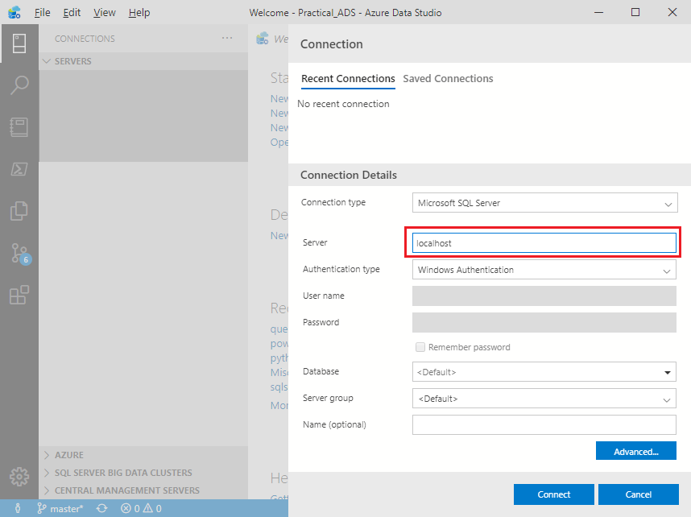
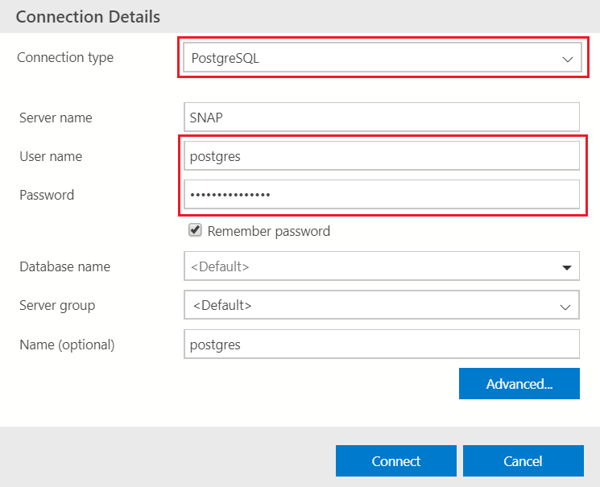

[Back](../readme.md)

# Chapter 2 - Everything Starts with a Connection
Most of what you do in Azure Data Studio, like most data engineering tools, will begin with a *connection*. ADS has some very helpful features for managing connections, whether your data is on premise, in the cloud, in a container, or even located in a file system.

## Creating, Using, and Managing Connections
Since there is no better way to learn than by doing, let’s go ahead and open Azure Data Studio. Figure 2-1 below shows the Welcome page which is designed to assist you in getting started with ADS.


Figure 2-1. Welcome page

The opening screen places you automatically in the context of *Connections* which is exactly where we want to start. Notice that the icons stacked vertically on the left side of the application (the ‘Activity Bar’) provide you access to other ADS functionality. A closer examination of these icons, as shown in figure 2-2, reveals that one of the icons is a little brighter than the others. This indicates the *current* ADS context, which also determines the contents of the detailed navigation (called the ‘Side Bar’) that is displayed in the pane immediately to the right of the Activity Bar.


Figure 2-2. Connection Access

The ‘Side Bar’ for Connections provides high level groupings for
- Servers
- Azure
- SQL Server Big Data Clusters

 which can be expanded to list individual connections and/or ‘sub’ grouping of connections. 

You can also add “Central Management Servers” to the above list by first installing the Microsoft *extension* for this feature. Steps for installing this are included in the last section of this chapter.

### Connecting to SQL Server

For our first connection, let’s connect to an ‘on-premise’ instance of SQL Server. To start, click on *Create a connection* in the "Welcome page" as outlined in figure 2-3:


Figure 2-3. Create a connection

You could also, open the ‘Servers’ container located in the ‘Side Bar’, and click on the ‘Add connection’ mini icon as shown in figure 2-4:


Figure 2-4. New connection from the ‘Servers’ container

In either case, the form shown in figure 2-5 will appear on the right side of the ADS application, allowing you to provide the details for your connection. If you would like to connect using your ‘Windows’ credentials, the only required field on this form is the ‘Server’ name of your SQL Server (instance). Also, if your SQL Server is running on the same computer as Azure Data Studio, you can generally reference it as simply ‘localhost’:



Figure 2-5. New connection form

Regarding "Authentication type", if you are connecting to an instance of SQL on Linux, you may need to use ‘SQL Login’. Similarly, if you are connecting to a database in Azure, you may want to use ‘Azure Active Directory’. The choice of Authentication types are highlighted in figure 2-6:


Figure 2-6. New connection form

The ‘Database’ option allows you to connect *directly* to a database on your target server. Leaving this field as ‘<default>’ will connect you at the ‘Server’ level, which when used will provide a ‘drill down’ option to get to the contained databases. Note that if you *do* specify a database name on this form, there is no ability to ‘drill-up’ to the hosting SQL Server when using that connection. Because of this, if you have many databases, you may want to have direct ‘database’ connections for your most frequented databases, and a general ‘server’ connection for the remaining databases.

If you have a *friendly* name for a given server (or database) you can use the optional ‘Name’ field located at the very bottom of the Connection form. One option for this ‘Name’ field could be to clarify the connection *context*. For example, if using a ‘SQL Login’ with perhaps limited access, you could append a short descriptive tag such as ‘Read Only’ to the ‘friendly’ connection name.

We will cover *grouping* connection names in a following section but suffice to mention at this point; your connections may appear under a ‘group’ heading, which by itself can provide additional ‘context’ to your connection names.

### Connecting to Azure SQL Database

Connecting to your database in Azure can be achieved in much the same way as connecting to an ‘on-premise’ instance of SQL Server. Figure 2-7 shows an example of connecting to an Azure SQL Database:


Figure 2-7. Connecting to Azure SQL Database

For Azure, you will want to specify the ‘Server’ using the fully qualified Azure URI which uniquely points your database [^azureURI]. Next provide an ‘Authentication type’ which in this case would be either ‘SQL Login’, or more preferably ‘Azure Active Directory’.

#### Azure Container in ADS

You can also use the ‘Azure’ container found in ADS ‘Side Bar’ to browse all your Azure based Servers and Databases as displayed in figure 2-8:


Figure 2-8. Azure Connections

To take advantage of this ‘Azure database browsing’ feature be sure that you have first *authenticated* with Azure Active Directory for your current ‘desktop’ session.

### Connecting to PostgreSQL

Connecting to PostgreSQL is very similar to connecting with SQL Server (whether on-prem, or in the cloud). Be sure to first install the PostgreSQL extension from Microsoft. This extension can be found by entering ‘postgres’ in the "Extensions Marketplace" control as shown in figure 2-9:


Figure 2-9. The PostgreSQL Extension

A sample connection definition for PostgreSQL is illustrated in figure 2-10.



Figure 2-10. Sample PostgreSQL Connection

You will want to use the "Connection type" of ‘PostgreSQL’. Note that this connection type (directly to PostgreSQL) only allows for "User name/Password" authentication. You could alternatively ‘browse’ your PostgreSQL servers and databases via the previously mentioned ‘Azure container’ in ADS.

## Grouping and Color Coding your Connections

Azure Data Studio allows you to organize your connections into groups which can optionally be ‘color coded’, both on the ‘Side Bar’, and at the top of the tabbed SQL editor windows. You have complete flexibility with grouping your connections, which might be based on:
- Server Names
- Functional Names (e.g., Dev/Test/Prod)
- Physical Locations
- Roles (e.g., Admin/Execute/Read Only)

Or any other grouping that facilitates your ‘connection’ navigation.

As an example, figure 2-11 demonstrates grouping and color coding based on development environments:


Figure 2-11. Sample Connection Groupings

To create your own groupings, you can use the same “Connections Details’ form which we used in the last section (see the ‘Server group’ field near the bottom of this form), or you can alternatively use the ‘Side Bar’ controls. To do this, notice the 3 mini icons that appear to the right of the ‘SERVERS’ label whenever you mouse over the connections ‘Side Bar’ as shown in figure 2-12:


Figure 2-12. Connection Icons

The center icon provides access to the ‘Add server group’ form which is illustrated in figure 2-13:


Figure 2-13. Server Group Configuration

Once ‘Server group names’ have been created, you can freely drag and drop ‘connections’ into the group of your choice, using the connections displayed in ‘Side Bar’.

### Color Coding Groups

The bottom of figure 2-13 renders the palette of colors you can select for your groups. A selected group color is not only used in the connections ‘Side Bar’ but can also be extended to the tabbed SQL editor windows. For this option, click on the ‘Manage’ (gear) Icon located at the bottom of the ‘Activity Bar’, choose ‘Settings’, and finally select a *‘Sql: Tab Color Mode’* (i.e., change to border, or fill) as shown in figure 2-14:


Figure 2-14. Sql: Tab Color Mode Setting

Once the color mode is set, your query editor windows will reflect its group ‘color coding’ as exhibited in figure 2


Figure 2-15. Sql: Color Coded SQL Editor Windows

To help you get started with creating and organizing connections, we have created the associated YouTube content: 

[**Video:** Creating Connections](https://youtu.be/lJRg4SzmEU8)
[**Video:** Server Groups](https://youtu.be/lJRg4SzmEU8)

For targeted viewing, the ‘grouping’ of connections starts at minute 03:35, and the ‘color coding’ begins at 04:45.

## Central Management Servers Extension

Azure Data Studio has an extension called ‘Central Management Servers’ which may also be used to group server level connections. This extension is found by typing ‘central’ in the Extensions Marketplace control as shown in figure 2-16:


Figure 2-16. Installing the ‘Central Management Servers’ Extension

What sets this feature apart from standard connection groupings in ADS is the ability to *execute a single command* on a ‘server group’. For example, if you wanted to execute the SQL command:

```sql
SELECT @@VERSION
```

on multiple servers, you could run this query against an entire ‘Server Group’. Figure 2-17 demonstrates this capability when running a query against the ‘OnPremise’ server group:


Figure 2-17. Querying a ‘Central Management’ Server Group

Notice the result set above is from *multiple* servers. In order to tie rows in the ‘results set’ back to the contributing server, ADS adds the ‘Server Name’ as the first column in the returned results. It should be mentioned that at the time of this writing the ‘Central Management Servers’ extension for ADS is in ‘preview’ mode, and not 100% functional. As a temporary fix, this feature is available and working in SQL Server Management Studio.

### Summary

Connections are generally your first step in working with databases, and this chapter has covered a variety of options that you have when using Azure Data Studio. You can have connections defined at the database or server level, grouped and color coded, on premise and in the cloud, and on SQL Server and PostgreSQL (with more ADS supported databases on the way). You can also ‘browse’ your Azure based Servers and Databases using an Azure authenticated user account.

We did not cover connecting to ‘Big Data Clusters’ since that is a deep topic which really needs its own book. We also did not discuss connecting to a database using an ADS supported language, such as Python or PowerShell. We will cover these connectivity options in subsequent chapters, with a particular focus on these languages in chapter 6.

[^azureURI]: If you are not sure of your database URI, it can be looked-up on Microsoft’s Azure Portal: https://azure.microsoft.com