[Back](../readme.md)

# Chapter 3 - SQL Editing Reimagined
Database developers typically spend a great deal of time creating and editing SQL queries, so it only makes sense to make this experience as helpful, convenient and productive as possible. Azure Data Studio has truly reimagined how developers interact with SQL coding, and for that matter, all the languages supported on the platform.

This is accomplished in large part by focusing directly on keyboard interactions, which incorporate IntelliSense, keywords, code snippets, and database object definitions. Much of the ADS User Interface is also *configurable*, providing customizable color themes, zoom levels, fonts, icons, as well as busy to minimal display panels.

## IntelliSense, Snippets and Object Definitions
To get started with entering SQL queries, you can either click on ‘New query’ from the Welcome page, or for more context specificity, right click on your target Database in the ‘Side Bar’, and choose ‘New Query’ as shown in figure 3-1:

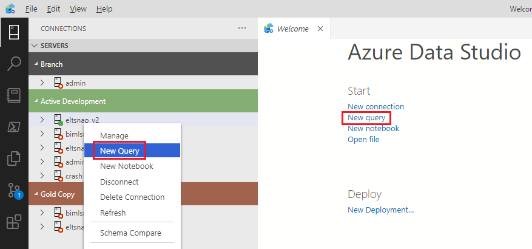

This will open a blank editing window where you can simply start typing. As you do type, each keystroke may pop-up with IntelliSense suggestions as shown in the Figure 3-2. Notice that the **FROM** keyword is highlighted in the sorted pop-up list indicating that you only need to hit the ‘tab’ key to accept the substitution.

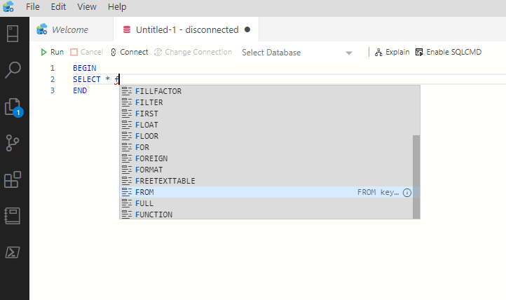

The up and down arrows provide navigation within this pop-up list, or you can use a mouse-click directly on the desired keyword. Also notice that figure 3-2 has the ‘Side Bar’ hidden, yielding a bit cleaner presentation. You can toggle the ‘Side Bar’ off and on by pressing the key sequence **Ctrl+B**. To accomplish the same with your pointing device, simply click on the ‘server icon’ in the ‘Activity Bar’ or use the ‘Menu Bar’ selections: View, Appearance, Show Side Bar.

### Code Snippets
One of my favorite editing features in ADS are powered by ‘Code Snippets’. These can be a huge timesaver, are fully integrated with IntelliSense, and best of all are user customizable. Let us walk through a quick Snippet example.

As an additional reference, we have created a video: [ADS Snippets](https://youtu.be/WSjKuqbvKjo) which demonstrates using snippets in Azure Data Studio

 Let’s say you wanted to create a table. By typing **createtable** you will see the ‘camel cased’ snippet *sqlCreatTable* pop-up. You just hit ‘Tab’ when highlighted, or optionally click on the snippet in the pop-up, and you will get the ‘Create Table’ template as displayed in figure 3-3:

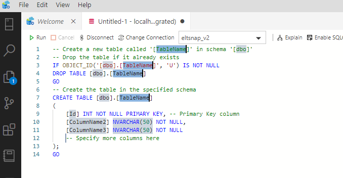

You may be surprised to now see 4 blinking cursors! The first reason for this, is you are automatically placed in the process of *completing* the pre-defined variable *placeholders* within the snippet. Additionally, the reason you have **4** blinking cursors is because the first ‘placeholder’ (TableName) has a total of 4 instances. If you were to next type ‘product’, the variable replacement would occur 4 times and figure 3-4 would be the result:

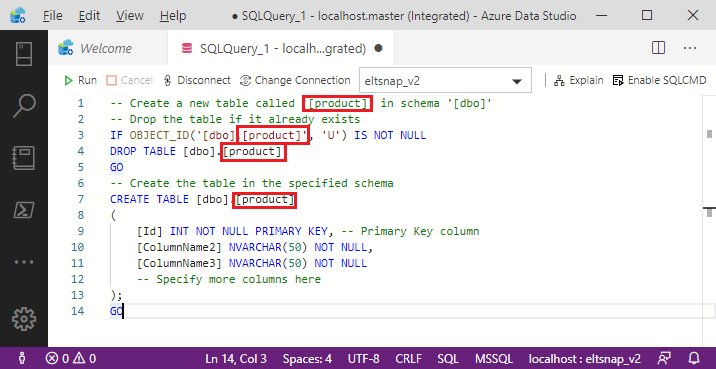

To move to the next defined variable, press the ‘Tab’ key again and you will see the next variable highlighted (this one used for the *schema* name) which happens also to have 4 occurrences which will change simultaneously. The next ‘Tab’ will take you to the first table column (in this case: **[Id]**), and so on until all variables have been visited, and optionally replaced. 

This ‘default’ (built-in) snippet is a nice start to creating a table, but you may be thinking “I’d like my snippet *customized* for our organization’s common code patterns”.  Not to worry, later in this chapter (as well as in chapter 9), we will cover how you can easily create your own snippets. Just like the built-in snippets, these will readily surface in your SQL editor, based on the very same *IntelliSense* driven keystrokes.

### Object Definitions

While you are editing your SQL Queries, it is a common requirement to reference ‘Object Definitions’ within your database model. For example, say you are writing a query requiring a certain table column, and need to know if it is allowed to contain **NULL** values. In this case, the standard IntelliSense capability of suggesting ‘column names’ falls a bit short. Instead, what is needed is the full *definition* of the table object.

Since your database could contain *hundreds* of tables, each of which can have numerous columns, it is often a pain to ‘quickly’ retrieve table and column definitions by browsing for these object definitions via the ‘Side Bar’. To remedy this situation, ADS provides direct access to object definitions, without leaving the editor window. Simply ‘right click’ on any table name in your query, and a couple options will pop-up. Figure 3-5 captures this pop-up when drilling into the table named: **oledb_connection**: 

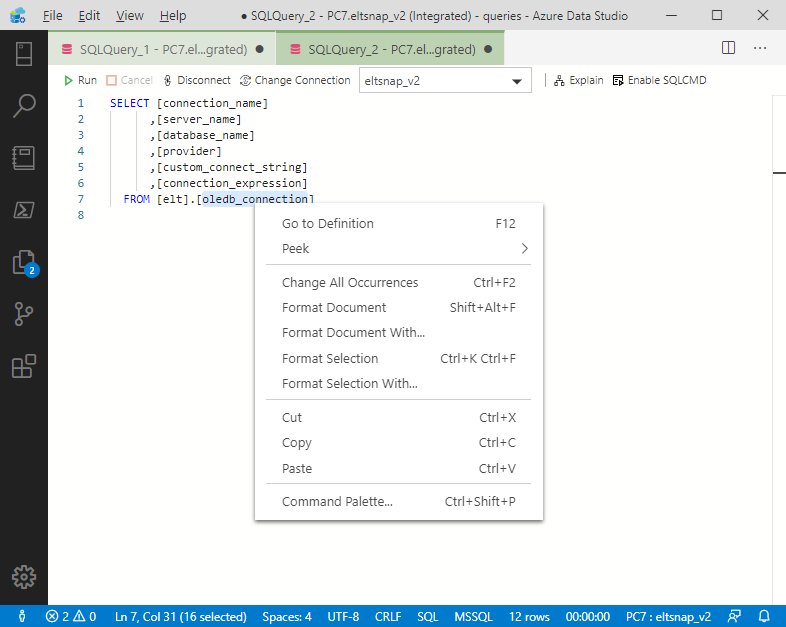

The top two options on this pop-up will provide you with table definitions. The first “Go to Definition” will open a new editor window with the table definition in the form of an official **table create** statement. Since this is an almost *runnable* script, this method provides a convenient way to *change* the definition of the table if needed. I mention *almost* runnable since an execution of this statement would fail because the table already exists. Assuming you are not concerned with *losing* the data contained in this table, you could precede this code block with a **DROP TABLE**… statement.

The second option “Peek Definition”, will furnish you with the same definition, but in this case rendered in the *existing* editor window as shown in the figure 3-6:

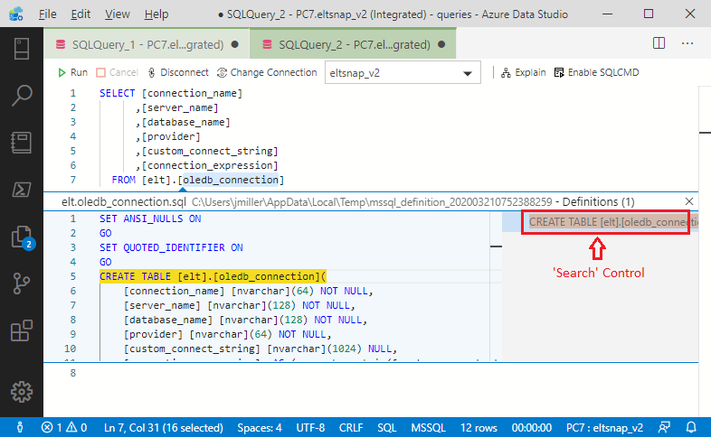

In the event the table definition has many columns, you can use the ‘Search Control’ located on the right side of the screen, to search for a ‘specific’ column definition.

### Creating a Snippet for Column Definitions
You may be thinking, “This is helpful for retrieving a column definition located in a single table”, but what if I want to see how the *same column* is defined in all tables?”. This is a good question, and one that could be answered by creating a custom snippet.

A good place to start when creating a snippet is to write the *base* query, which in our example will employ the INFORMATION_SCHEMA.COLUMNS system view, to run initially against the msdb ‘system’ database. In the query, we will be searching for *all* definitions of the **plan_name** column located in this database:

``` sql
select * from msdb.INFORMATION_SCHEMA.COLUMNS 
where COLUMN_NAME = 'plan_name'
```
A subset of the columns returned from running the above query are shown in figure 3-7:

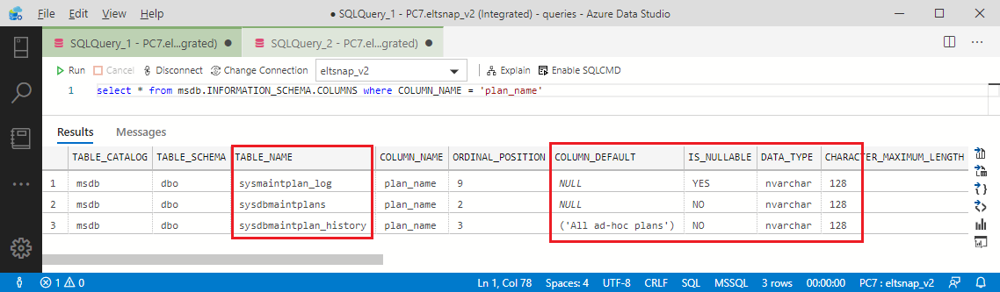

The result shown above reveals that the column **plan_name** is found in 3 tables within the **msdb** database. We discover that the column is defined with a consistent data type of ‘nvarchar’, but varies in terms of ‘nullability’ as well as ‘default’ values.

You could now save this helpful little snippet (or ‘template’) as a stand-alone query residing in your file system, or *convert* it to a formal ‘ADS Snippet’. The former would be accessed when needed by navigating within the file system (i.e., File, Open), and the later would be retrieved by keystrokes directly in the SQL editor window. Another consideration is a formal ‘ADS Snippet’ can optionally provide *variable* substitution, which can greatly simplify the re-use of your custom snippets.

Regardless of your choice, the next section will cover how to save your ADS queries into the File System, as well as how to save customized ADS Snippets.

## Saving Queries and Snippets
When working with multiple ‘file based’ queries, it is helpful to organize related scripts into a common folder structure. To achieve this, you simply select (or optionally create) a folder using the ‘Menu Bar’ File, Open Folder command as shown in figure 3-8. This will establish your ‘current’ folder context:

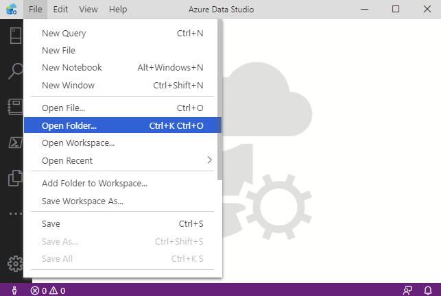

In the case you need to create a New folder, you can still use the ‘Open Folder’ dialog box. This is done by clicking in the ‘white space’ (next to the existing folders) where you will be able to enter a new folder name via a pop-up window. The navigation for this user action is presented in figure 3-9:

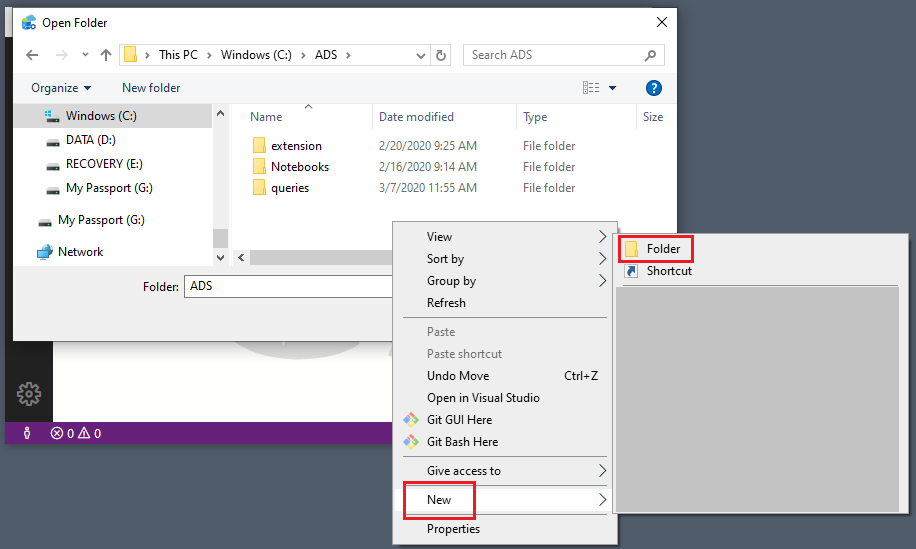

Once you have selected your ‘current’ folder context, queries and scripts that you later save will be placed in this folder by default. The File icon in the ‘Activity Bar’ as shown in Figure 3-10 provides the name of your *current* folder context. 

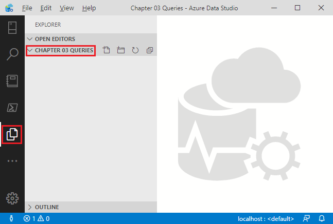

Keep in mind that your working folders could later be tied to GitHub or other source control system. Consequently, your folder organization and naming conventions should be as intuitive as possible. Even if you are not sharing with others, you may find that GitHub is a convenient repository to store your personal queries and scripts. This is both for safe keeping, as well as *accessibility* in the event you are away from your primary workstation (see Chapter 13 for a ‘Deep Dive’ into GitHub and ADS).

Now that we have a ‘current’ folder, let us tweak and then save our earlier INFORMATION_SCHEMA.COLUMNS query into the file system. Following is a bit more *generic* version of the earlier query:

```sql
select * from INFORMATION_SCHEMA.COLUMNS where COLUMN_NAME = 'column_name'
```

As you might have guessed, pressing CTRL + S will open the ‘Save’ dialog box, or you could use File, Save, from the ‘Menu Bar’. In either case you will receive the dialog box shown in figure 3-11 where you can name your file-based query:

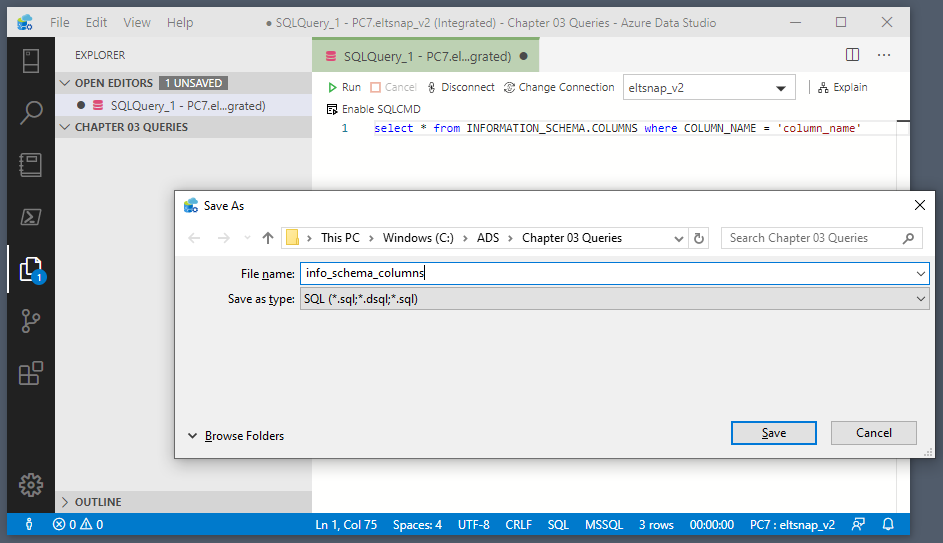

Ok, saving a file is admittedly a pretty basic user action. However, what if you would like to save this query as a reusable *ADS Snippet*? Well for starters we will want to make another tweak to this script which will invoke the ‘variable substitution’ logic on re-use. This is achieved by replacing '**column_name**' with the parameter syntax **${1:ColumnName}** as shown in the following code block:

```sql
select * from INFORMATION_SCHEMA.COLUMNS where COLUMN_NAME = '${1:ColumnName}'
```
Note: for simpler snippet coding, we will place this query on a single line in the full json snippet syntax: 
```json
 { "Information Schema for Columns": {
  "prefix": "InfoSchemaColumns",
  "body": "select * from INFORMATION_SCHEMA.COLUMNS where COLUMN_NAME = '${1:ColumnName}'" } }
```
To break down the above json code, the first line containing the literal "Information Schema for Columns " is the snippet *name*. The next line contains the *prefix* “InfoSchemaColumns” and will cause this snippet to surface based on similar keystrokes made in the SQL editor. These keystrokes do not necessarily need to be keyed exactly as shown in the *prefix*. For example, the snippet above, would be found by just typing ‘infcol’. The third line is the snippet code itself, which will be placed directly in the editor window upon pop-up selection.

To save the snippet, press CTRL+SHIFT+P (or from the ‘Menu Bar’ click on View, Command Palette), enter ‘snippet’ in the search box, and select “Preferences: Configure User Snippets” as shown in figure 3-12:

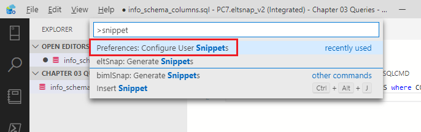

Next enter ‘sql’ into the snippet search, and select the file: "sql.json" as displayed in figure 3-13:

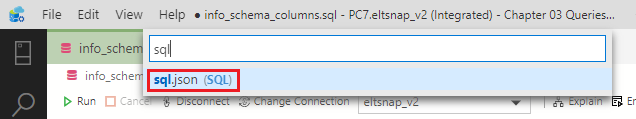

And then paste in your json script as shown in figure 3-14:

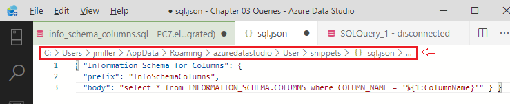

Notice the above window (outlined in red) also provides the physical location of the ‘sql.json’ file that you are modifying [^sniplocation]. Press CTRL+S to save your changes which will enable your new snippet to be used. To test, press CTRL+N to create a new query window and then type the character sequence: ‘infcol’. You should see the snippet pop-up as rendered in figure 3-15:

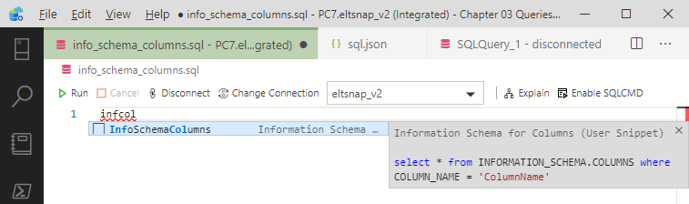

Selecting this snippet will produce the SQL code in your editor window, with the cursor highlighting the field (in this case **ColumnName**) allowing you to replace with the actual column name you are examining. Figure 3-16 displays the snippet as placed in the editor window:

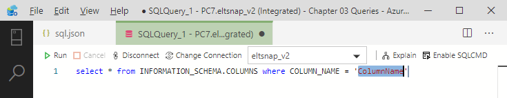

As mentioned earlier, we have more content on ‘ADS Snippets’ to come later in the book, which by the way can apply to *any* of the Azure Data Studio supported languages, including PowerShell and Python.

## Top Down View with Minimap
Life at times can be detailed and complex. The same can be true of ‘SQL code’, or for that matter ‘code’ written in any language. Most database developers have written, reviewed, or maintained SQL scripts that exceeds one hundred, or perhaps even one thousand lines of code. While ‘big code’ can be intimidating, ADS has a *Minimap* feature that can at least ease the pain of working with large SQL scripts.

> For the following example you can use **any** SQL code sample. If more lines are needed for visual effect, just use copy/paste to multiply your lines of SQL code.

To get started with Minimap, you will first want to turn this feature on via the ‘Command Palette” by pressing CRTL+SHIFT+P, typing ‘minimap’, and selecting “View: Toggle Minimap” as shown in figure 3-17:

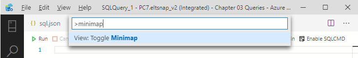

With any SQL script in place, and with Minimap turned on, you will see a birds-eye outline of your code on the right side of the editor window. Your current ‘cursor position’ will be highlighted as a thin blue line as displayed in figure 3-18:

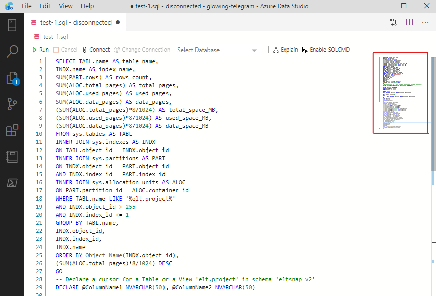

Syntax errors are reflected in the Minimap with red highlighting as shown in figure 3-19. This is helpful as it gives immediate feedback, as well as proximity of the error, even if the actual (readable) SQL code located somewhere ‘off screen’.

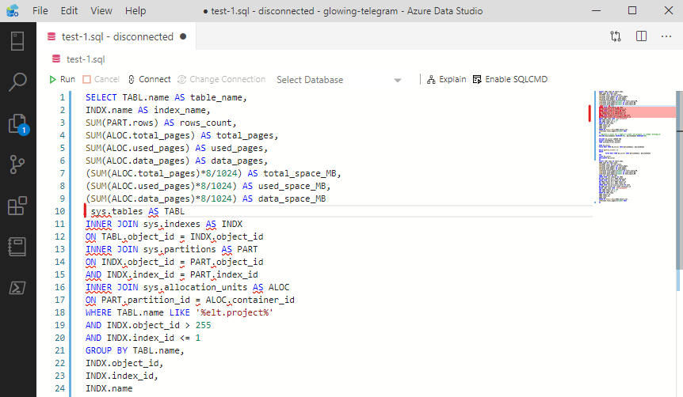

Another nice feature of Minimap is the ability to view a large *selection* of your code, even spanning hundreds of lines. This reduces the excess ‘scrolling’ otherwise needed to visualize the begin and end of your selection. Figure 3-20 demonstrates this capability, albeit on a smaller scale.

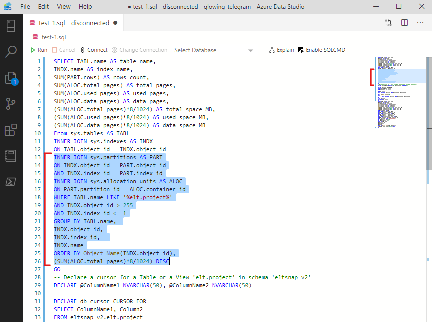

Finally, Minimap provides a convenient way to visualize *all* locations containing the text you are searching for in the script. Figure 3-21 illustrates the result of searching for a table called **elt.projects** within a script.

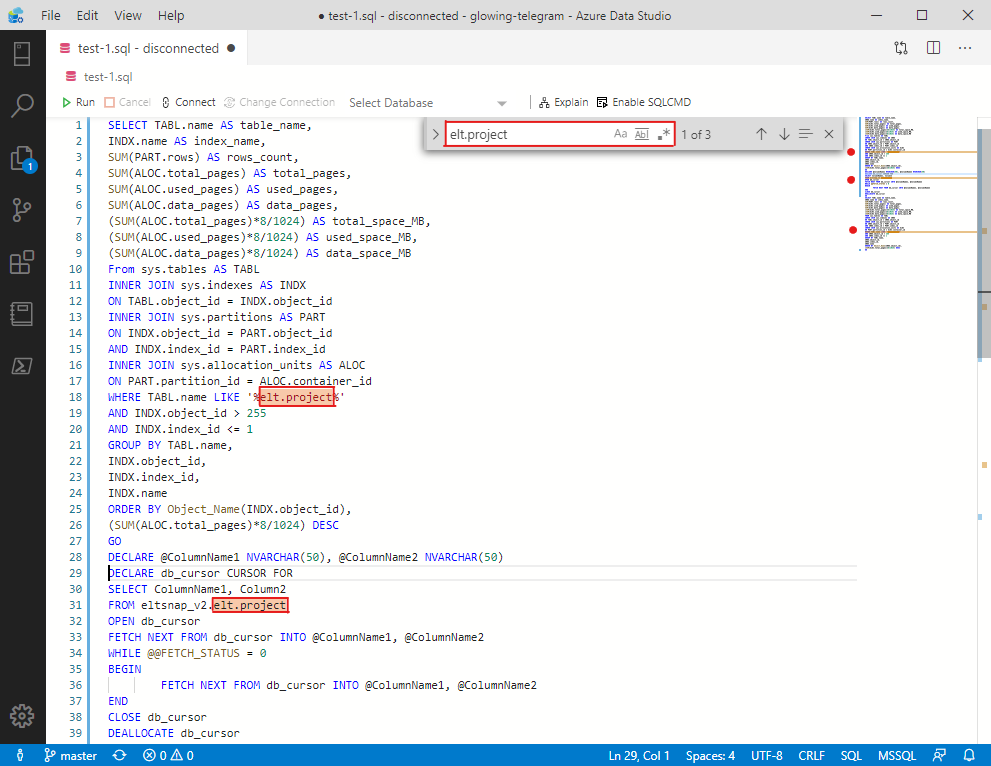

So, the next time you find yourself editing a painfully large block of SQL code, remember to ‘toggle on’ Minimap to make your task at least a little more manageable.

## SQL Queries via the Command Terminal

An interesting capability of Azure Data Studio is the integration of a standard SQL editor with other language options. These language options are available by using *Notebooks* (introduced beginning in Chapter 5), as well as by using the integrated *Terminal* window, which we will introduce next.

To open the *Terminal* window, press CTRL+` (backtick), or when using the ‘Menu bar’, select View, Terminal. Once opened, you will see the Terminal pane on the bottom right section of the ADS application as shown in figure 3-22:

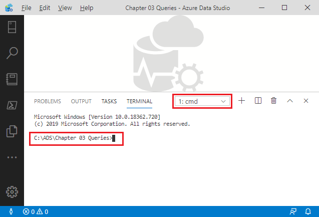

Notice the Terminal opens in the context of the ‘Windows Command Prompt’ which also inherits the *Folder* location that was previously opened in ADS (in our case it was named “Chapter 03 Queries”). Although we could query SQL via the Windows Command Prompt using *isql.exe*, we will have more options when using PowerShell. To switch the context to PowerShell, you can simply type ‘PowerShell’ (or PWSH for "PowerShell Core") into the Terminal window to get the results displayed in Figure 3-23:

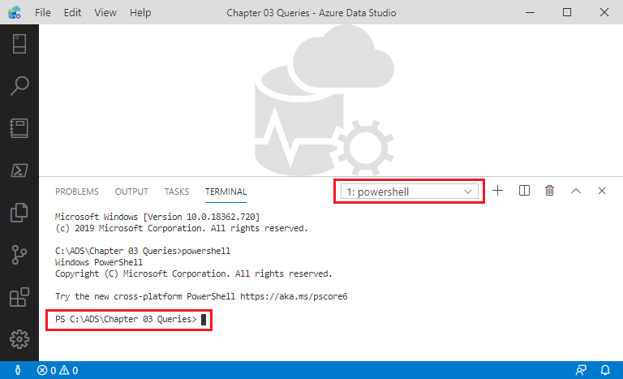

> Note: In Chapter 15 we will use the new “PowerShell Integrated Console” which activated by using the PowerShell Icon on the Activity Bar.

To query your ‘local instance’ of SQL Server, enter the following command into the PowerShell command prompt:

```powershell
Invoke-Sqlcmd -Query "select * from INFORMATION_SCHEMA.TABLES" -ServerInstance "localhost"
```
And hit enter. You should see the SQL query results shown in figure 3-24:

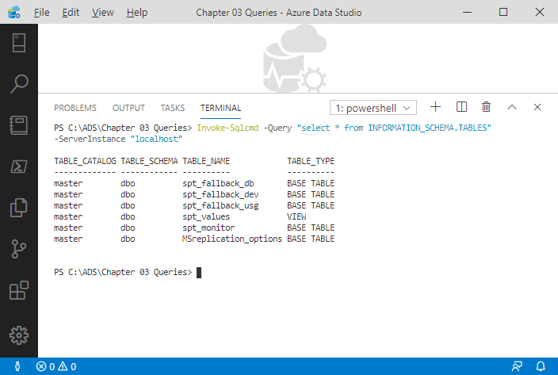

Since we are in PowerShell, we have many other options for our result set, such as *exporting* as a CSV file. This can be accomplished by running the following PowerShell script:
```powershell
Invoke-Sqlcmd -Query "select * from INFORMATION_SCHEMA.TABLES" -ServerInstance "localhost" | export-csv -Delimiter ',' -Path "tables.csv" -NoTypeInformation
```
When running this PowerShell script in the Terminal, the prior results are now are *piped* to an Operating System file called ‘tables.csv’. To verify that the file was created, click on the ‘Explorer’ Icon in the ‘Activity Bar’. The file should now be visible in the ‘Side Bar’ as shown in figure 3-25:

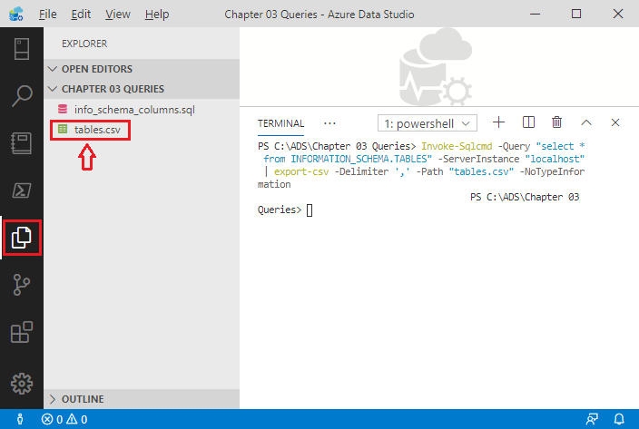

The above exercise is a fairly simple yet instructive example of the ‘synthesis’ of a traditional SQL query, with the extended language support built into Azure Data Studio. This illustration leveraged the ADS Terminal window running PowerShell, that leveraged a SQL script. Do read on as deeper and even surprising capabilities lie ahead when fusing SQL code with other ADS supported languages!

[^sniplocation]: This file could be updated using any editor, or json code generator