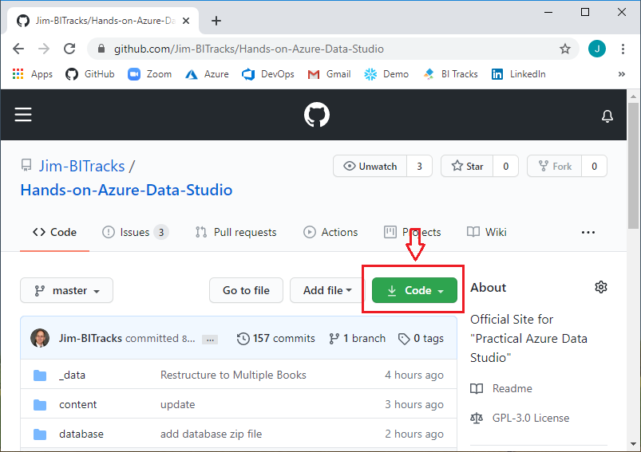

[Back](../readme.md)

# Introduction
Back in 1980, while busily programming Basic on a Dec PDP-11 in Cincinnati, I was introduced by a friend to a new software product called ‘VisiCalc’. It was the burgeoning micro-computer era, along with the infancy of personal software programs. My less than thoughtful reaction to the glowing flicker of green lines and text in VisiCalc, was “**Meh**… not really feeling it”. After all, who really needs an *electronic* Spreadsheet...

I now realize how quickly I dismissed not only a revolutionary product, but an entirely new way to personally interact with software. Forty years later, with my acquired gray and white hair, and while attending the SQL PASS Summit conference in Seattle, I was introduced to a new product called “Azure Data Studio”. This time my reaction was not: ‘**Meh**…’; but instead: ‘**Wow!**’. 

## Who this book was written for
Data and Database engineers, and anyone who is involved in exploring and analyzing data. This includes SQL developers, data analysts, data scientists, and database administrators. This books will also be helpful for professionals involved in data integration and data warehousing, as well as for Python and PowerShell developers looking for a *data centric* platform for using their language of choice.

In addition, you do not need to be on **Azure**! Azure Data Studio works equally as well with on-premise databases as it does with databases living on the Azure platform.

## What you need to get the most from this book
Azure Data Studio is free for both private and commercial use, and can be downloaded from:
https://docs.microsoft.com/en-us/sql/azure-data-studio/download-azure-data-studio?view=sql-server-ver15

Azure Data Studio runs on Windows, macOS, and Linux (refer to the above link for supported OS versions).

“Database Platforms” supported at the time of this writing are SQL Server and PostgreSQL, which includes both On-premise and Cloud instances.

> Note: the 'sample database' used in many code examples is based on SQL Server 2019

If you do not have a database system handy, and would like to start with a free version of SQL Server, you have a couple options: **Developer** and **Express** Editions. SQL Server can be downloaded using this [Link](https://www.microsoft.com/en-us/sql-server/sql-server-downloads).

## Source Code and Notebook Samples

All the supporting SQL, PowerShell, and Python scripts, along with Notebooks, and the 'car_crash' sample database can downloaded from this book's GitHub repository: [Hands-on Azure Data Studio](https://github.com/Jim-BITracks/Hands-on-Azure-Data-Studio.git) as shown in Figure I-1:. 

Figure I-1. GitHub Site for Book

>If this is the first time you have 'cloned' a repository using Git, please jump ahead to **Chapter 7** for a step-by-step walkthrough to download this GitHub repository.

### Companion Database
The sample 'SQL Server' database referenced by many of the code samples is included in the aforementioned GitHub repository. See 'Appendix A' for a quick reference of the database schema.

## About the Author
Jim is the President of BI Tracks Consulting and is on a mission to help people with all things Data, and specializing in the rapid construction of Data Warehouses.

[BI Tracks Consulting](https://www.bitracks.com/)

Jim has worked in many facets of the IT business for over 30 years, with a focus on data warehousing, data integration, reporting and analytics, business intelligence, data modeling (relational, multi-dimensional), ELT/ETL frameworks, database architecture, and database performance tuning. In previous engagements, Jim has fulfilled roles as Data Architect, DBA, IT Director, and Senior Consultant. He also has experience in account management, marketing/technical support, and software application training. Jim has also had some extraordinary opportunities to lead IT organizations, with multi-national participants, on reconstruction projects based in Bosnia as part of the Dayton Peace Agreement, and more recently in Iraq with the US Department of State.

## Why this book
After stumbling across “Azure Data Studio” (ADS) at the SQL PASS Summit 2019 in Seattle, Jim realized that this product/platform could *revolutionize* how we interact, discover, process, and share data and analytics. Knowing also that this new approach to data engineering and related processes would be a fascinating 'journey', Jim decided to  document the capabilities, and share the lessons learned. This book, which has now morphed into a book series (starting with the one you are reading), is the result.
